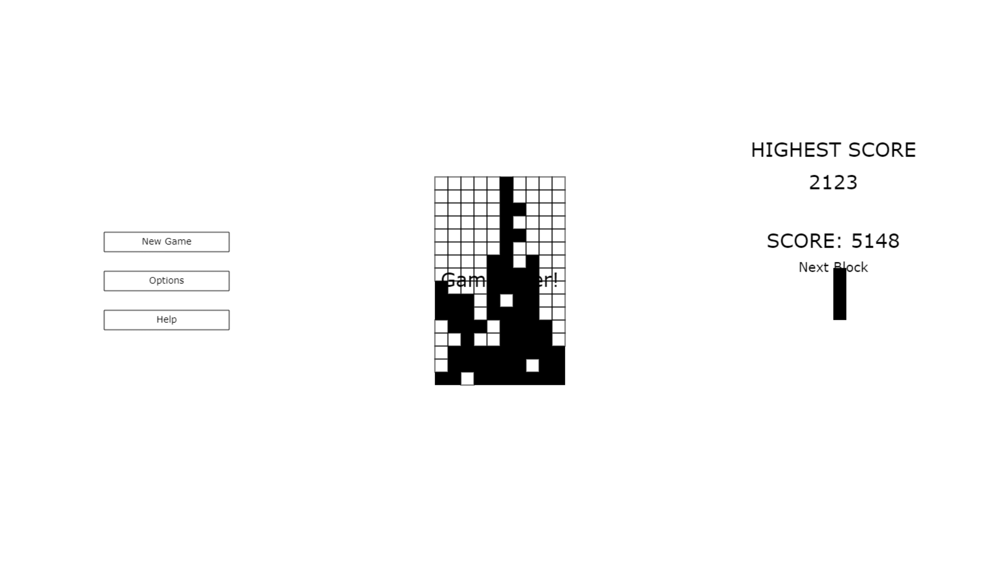

# Build Blocks
Build Blocks is a block managing 2d arcade game similar to tetris game. Tetris is a puzzle video game created by Soviet software engineer Alexey Pajitnov in 1984. Build with JS and canvas api for rendering.

	

## LIVE DEMO

## Tech Used
- HTML
- Plain JS - Canvas 2D
